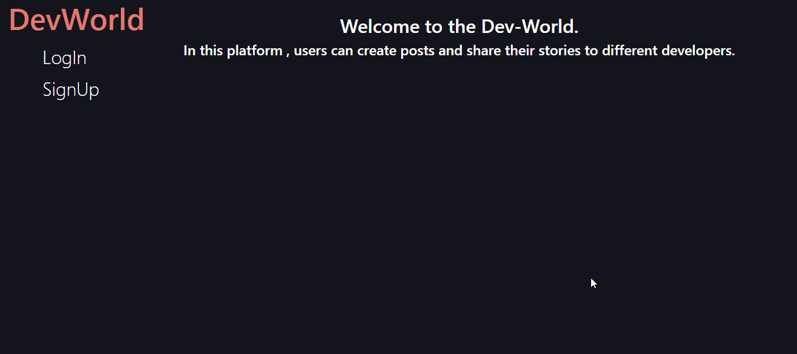

# DevWorld

DevWorld is a social media platform where users can create new post and like each other posts and put comments on them. Moreover, users will also receive the notifications of other users.

## Table of Contents

-   [Contributors](#contributors)
-   [Technologies](#technologies)
-   [Features](#features)
-   [Usage](#usage)

---

## Contributors

-   [Gurkiran Singh](https://github.com/g4rry420)

## Technologies

-   JavaScript
-   React.js
-   Redux
-   Bootstrap
-   Firebase

## Features

-   User login/sign up secure authentication using Firebase Auth services.
-   Users can create Text based posts
-   Users will see other users posts
-   Users will receive notification if another create posts or signup for the first time
-   Users can comment on posts.
-   Users can :heart: each other's posts.
-   Persistand storage for posts using the Firebase.

## Usage

-   `npm start` - To start the project.
